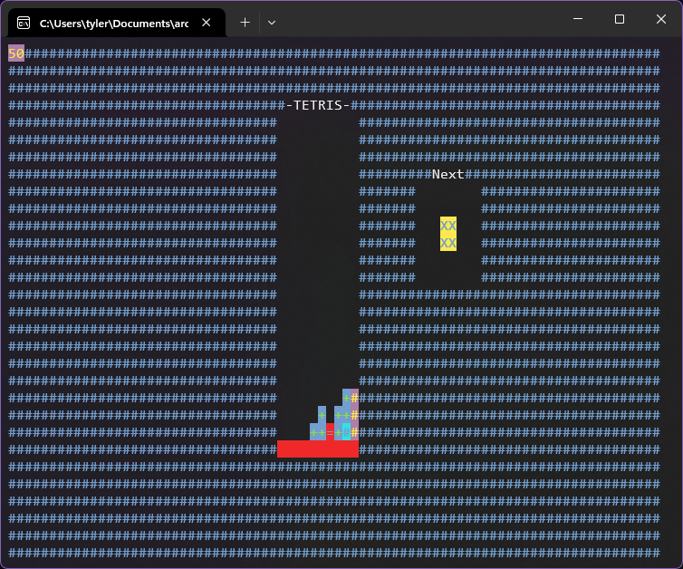

# Tetris C++

I wanted to share this game that I made when I was learning C++. While there was a more finished version, I seem to have lost it. Also, a few changes were made just so that it could compile.

## Controls

'a' and 'd' keys: move left and right

's' key: fall faster

'e' and 'q' keys: rotate clock-wise and anti-clock-wise